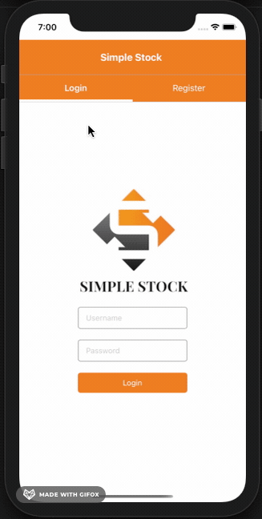
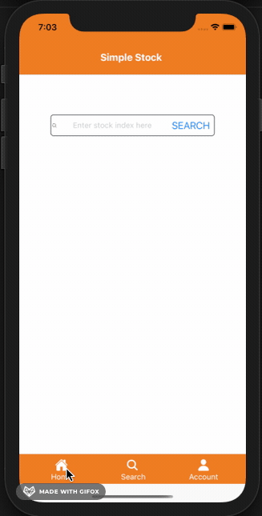
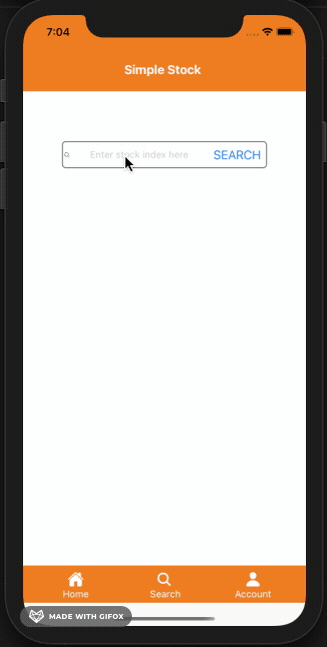
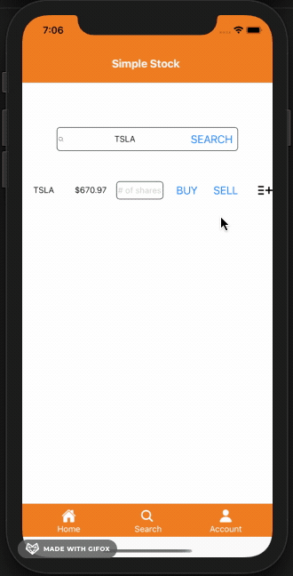
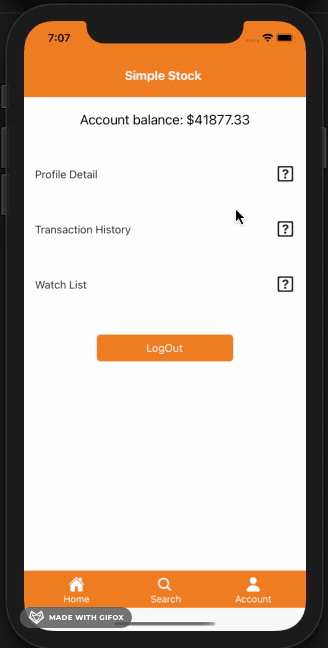

# Simple Stock

## Team

Russell Telen (FS), Karen Mok (FE), Kirill Kutnenko (FE), Tilman Queitsch (BE)

## App Summary

Simple Stock is a cross-platform mobile application using React Native in the client / front-end, and Node.js with MongoDB in the back-end.

## Features

- authorization / authentication capacities
- stock search using the finnhub.io API
- user-specific
  - buy / sell functionality
  - portfolio overview
  - watchlist for stocks

## Preview

### Login/Register Screen

### Home Screen

### Search Screen (Buying and Selling Stocks)

### Search Screen (Adding Stock to watchlist)

### Account Screen (View cash balance, account info, transactions and watchlist)

## Server Endpoints

All endpoints begin with with "/api".

### /users

- /register - POST to add a new user
- /login - POST to log a user in
- /logout (AUTH) - POST to log a user out
- /financials (AUTH) - GET a user's transactions
- /portfolio (AUTH) - GET a user's portfolio

### /transactions

- / (AUTH) - GET a user's transactions

### /watchlist

- / (AUTH) - POST to add a stock to a user's watchlist
- /:stockId (AUTH) - DELETE to remove a stock from a user's watchlist

## App Requirements

- React Native
- Node.js
  _Note:_ You will need to installed the necessary node modules for both client and server.
- Atlas MongoDB
  _Note:_ You will require the connection string for your Atlas instance, or run MongoDB locally.
- finnhub.io API key in ENV files
  _Note:_ This is a requirement for both the server and the client folders since both access the Finnhub API.
